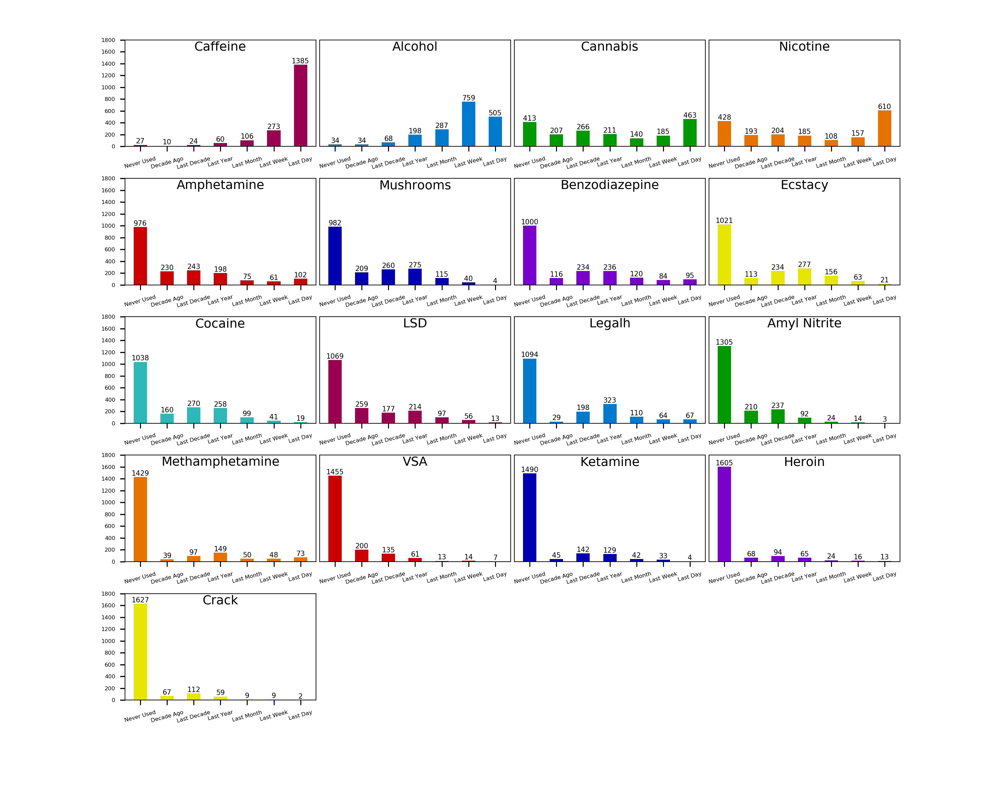

# Drug Consumption Analysis Using Random Forest
## Members:
Name | Contributions
------------ | -------------
Shyam Patel | Classification, correlation heatmap, report, slides
Carlos McNulty | Random Forest, data exploration, report, slides
Manasa Kandimalla | Clustering, data preparation, report, slides

## Datasets
* [drug_consumption.csv](drug_consumption.csv) - the original dataset from the [UCI Machine Learning Repository](https://archive.ics.uci.edu/ml/datasets/Drug+consumption+%28quantified%29)
* [train_data.csv](train_data.csv) - training data
* [test_data.csv](test_data.csv) - testing data

The data for our project consists of a single dataset titled Drug consumption donated to the UCI Machine Learning Repository in 2016. The original owners of the database are Elaine Fehrman, Vincent Egan and Evgeny M. Mirkes. The database contains records for 1,885 respondents. For each respondent, 12 attributes are known: measurements which include NEO-FFI-R (neuroticism, extraversion, openness to experience, agreeableness, and conscientiousness), BIS-11 (impulsivity), and ImpSS (sensation seeking), level of education, age, gender, country of residence and ethnicity. Each respondent also provided their usage for 18 legal and illegal drugs, including the fictitious drug Semeron. The 7 categories for drug usage consist of: (1) never used, (2) used over a decade ago, (3) used in the last decade, (4) used in the last year, (5) used in the last month, (6) used in the last week, and (7) used in the last day.

