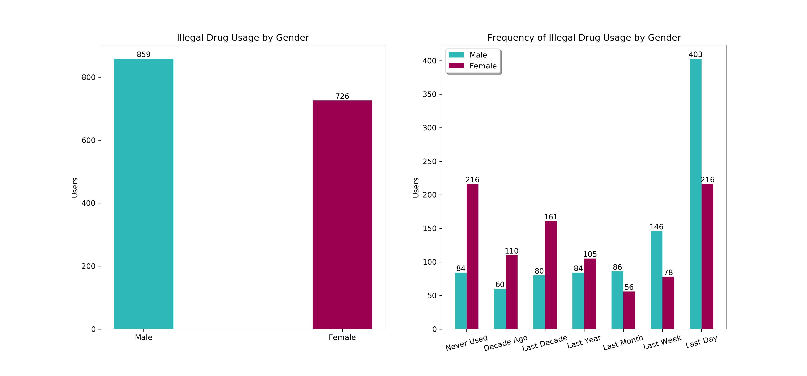

# Drug Consumption Analysis Using Random Forest
## Members:
Name | Contributions
------------ | -------------
Shyam Patel | Classification, correlation heatmap, report, slides
Carlos McNulty | Random Forest, data exploration, report, slides
Manasa Kandimalla | Clustering, data preparation, report, slides

## Datasets
* [drug_consumption.csv](drug_consumption.csv) - the original dataset from the [UCI Machine Learning Repository](https://archive.ics.uci.edu/ml/datasets/Drug+consumption+%28quantified%29)
* [train_data.csv](train_data.csv) - training data
* [test_data.csv](test_data.csv) - testing data

